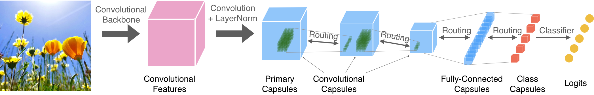
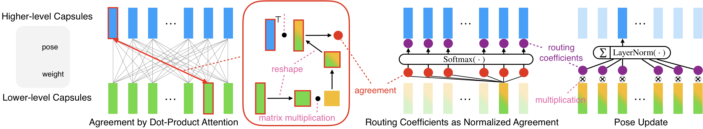
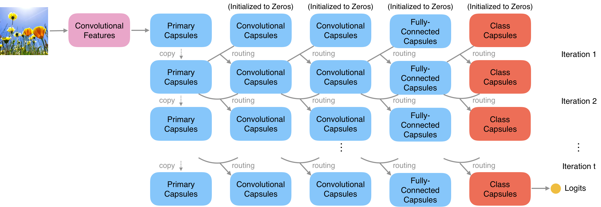

  

# Capsules with Inverted Dot-Product Attention Routing

> Pytorch implementation for Capsules with Inverted Dot-Product Attention Routing.

  
 ## Paper
 [**Capsules with Inverted Dot-Product Attention Routing**](https://openreview.net/pdf?id=HJe6uANtwH)<br>
 [Yao-Hung Hubert Tsai](https://yaohungt.github.io), Nitish Srivastava, Hanlin Goh, and [Ruslan Salakhutdinov](https://www.cs.cmu.edu/~rsalakhu/)<br>
International Conference on Learning Representations (ICLR), 2020. 

Please cite our paper if you find our work useful for your research:

```tex
@inproceedings{tsai2020Capsules,
  title={Capsules with Inverted Dot-Product Attention Routing},
  author={Tsai, Yao-Hung Hubert and Srivastava, Nitish and Goh, Hanlin and Salakhutdinov, Ruslan},
  booktitle={International Conference on Learning Representations (ICLR)},
  year={2020},
}
```

## Overview

### Overall Architecture
<p align="center">


An example of our proposed architecture is shown above. The backbone is a standard feed-forward convolutional neural network. The features extracted from this network are fed through another convolutional layer. At each spatial location, groups of 16 channels are made to create capsules (we assume a 16-dimensional pose in a capsule). LayerNorm is then applied across the 16 channels to obtain the primary capsules. This is followed by two convolutional capsule layers, and then by two fully-connected capsule layers. In the last capsule layer, each capsule corresponds to a class. These capsules are then used to compute logits that feed into a softmax to computed the classification probabilities. Inference in this network requires a feed-forward pass up to the primary capsules. After this, our proposed routing mechanism (discussed later) takes over.

### Inverted Dot-Product Attention Routing
<p align="center">


In our method, the routing procedure resembles an inverted attention mechanism, where dot products are used to measure agreement. Specifically, the higher-level (parent) units compete for the attention of the lower-level (child) units, instead of the other way around, which is commonly used in attention models. Hence, the routing probability directly depends on the agreement between the parent’s pose (from the previous iteration step) and the child’s vote for the parent’s pose (in the current iteration step). We (1) use Layer Normalization (Ba et al., 2016) as normalization, and we (2) perform inference of the latent capsule states and routing probabilities jointly across multiple capsule layers (instead of doing it layer-wise). 

### Concurrent Routing
<p align="center">


The concurrent routing is a parallel-in-time routing procedure for all capsules layers.

## Usage

### Prerequisites
- Python 3.6/3.7
- [Pytorch (>=1.2.0) and torchvision](https://pytorch.org/)
- CUDA 10.0 or above

### Datasets

We use [CIFAR10 and CIFAR100](https://www.cs.toronto.edu/~kriz/cifar.html).

### Run the Code

#### Arguments

|     Args    |                        Value                        | help                                                                                                                                                                            |
|:-----------:|:---------------------------------------------------:|---------------------------------------------------------------------------------------------------------------------------------------------------------------------------------|
|    debug    |                          -                          | Enter into a debug mode, which means no models and results will be saved. True or False                                                                                                       |
| num_routing |                          1                          | The number of routing iteration. The number should > 1. |
|   dataset   |                       CIFAR10                       | Choice of the dataset. CIFAR10 or CIFAR100.                                                                                                                                                         |
|   backbone  |                        resnet                       | Choice of the backbone. simple or resnet.                                                                                                                                                        |
| config_path | ./configs/resnet_backbone_CIFAR10.json | Configurations for capsule layers.                                                                                                                                              |

#### Running CIFAR-10 

```bash
python main_capsule.py --num_routing 2 --dataset CIFAR10 --backbone resnet --config_path ./configs/resnet_backbone_CIFAR10.json 
```
When ```num_routing``` is ```1```, the average performance we obtained is _94.73%_.

When ```num_routing``` is ```2```, the average performance we obtained is _94.85%_ and the best model we obtained is _95.14%_.


#### Running CIFAR-100

```bash
python main_capsule.py --num_routing 2 --dataset CIFAR100 --backbone resnet --config_path ./configs/resnet_backbone_CIFAR100.json 
```

When ```num_routing``` is ```1```, the average performance we obtained is _76.02%_.

When ```num_routing``` is ```2```, the average performance we obtained is _76.27%_ and the best model we obtained is _78.02%_.


## License
This code is released under the [LICENSE](LICENSE) terms.
